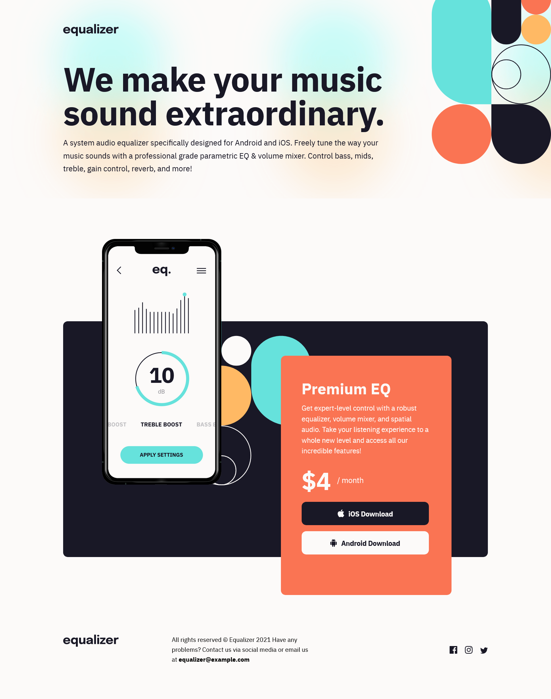
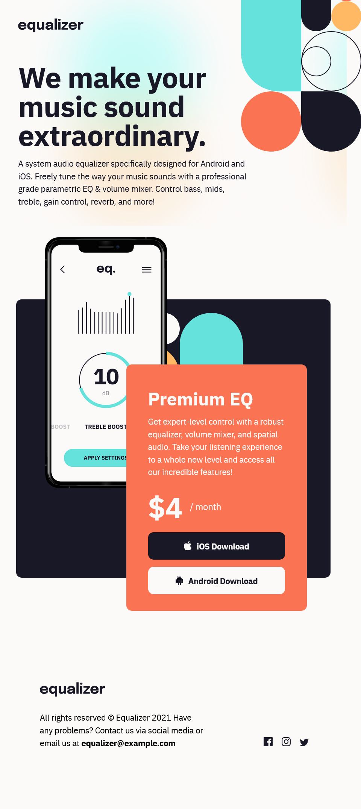
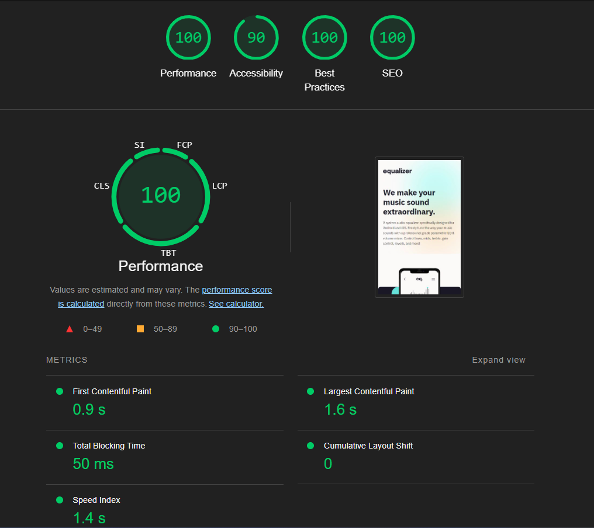
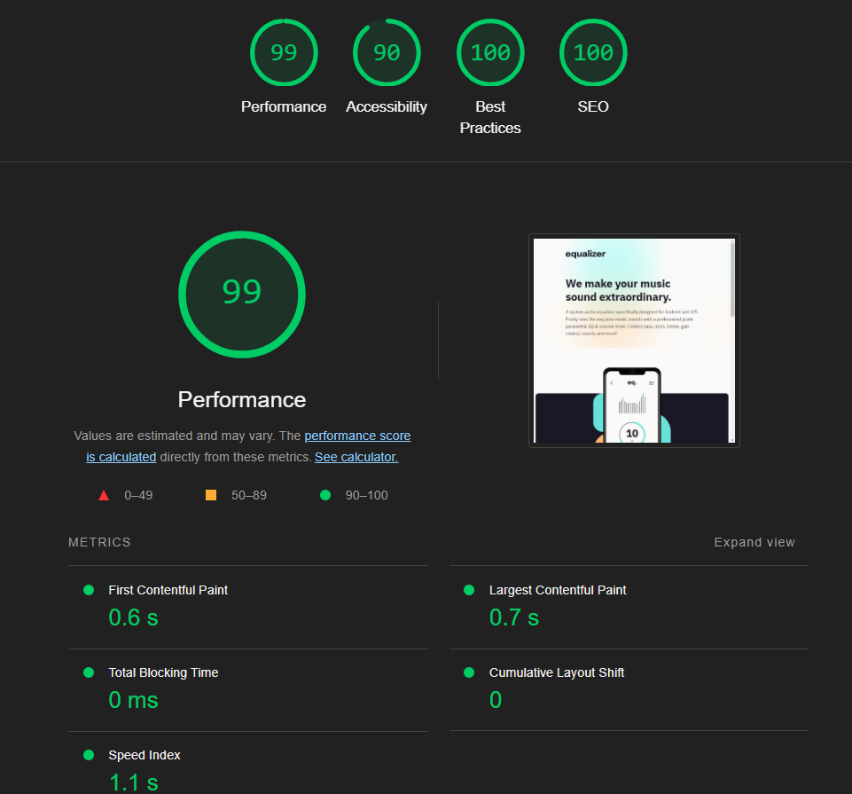

# Frontend Mentor - Equalizer landing page solution - Saurav Kumar Verma

This is a solution to the [Equalizer landing page challenge on Frontend Mentor](https://www.frontendmentor.io/challenges/equalizer-landing-page-7VJ4gp3DE). Frontend Mentor challenges help you improve your coding skills by building realistic projects.

## Table of contents

- [Overview](#overview)
  - [The challenge](#the-challenge)
  - [Screenshot](#screenshot)
  - [Links](#links)
- [My process](#my-process)
  - [Built with](#built-with)
  - [What I learned](#what-i-learned)
  - [Useful resources](#useful-resources)
- [Author](#author)

## Overview

### The challenge - Completed

Users should be able to:

- View the optimal layout depending on their device's screen size
- See hover states for interactive elements

### Screenshot

#### Desktop View



#### Tablet View



#### Mobile View


#### Lighthouse Test




### Links

- Solution URL: [https://github.com/saurav-verma-01/Frontend-Mentor-Equalizer-landing-page](https://github.com/saurav-verma-01/Frontend-Mentor-Equalizer-landing-page)

- Live Site URL: [https://equalizer-sv.netlify.app/](https://equalizer-sv.netlify.app/)

## My process

### Built with

- Semantic HTML5 markup
- CSS custom properties
- Flexbox
- Mobile-first workflow
- CSS Variables
- CSS Media Queries
- Self Hosted Fonts using @font-face
- Vite

### What I learned

While accomplishing this challenge, I have acquired the skill to utilize self-hosted fonts via the @font-face property in CSS.

```
@font-face {
  font-family: "IBM Plex Sans";
  src: local("IBM Plex Sans Reg")
      url("../../assets/fonts/ibmplexsans-regular-webfont.woff2")
      format("Woff2"),
    url("../../assets/fonts/ibmplexsans-regular-webfont.woff") format("Woff");
  font-style: normal;
  font-weight: 400;
}

@font-face {
  font-family: "IBM Plex Sans";
  src: local("IBM Plex Sans Bold")
      url("../../assets/fonts/ibmplexsans-bold-webfont.woff2") format("Woff2"),
    url("../../assets/fonts/ibmplexsans-bold-webfont.woff") format("Woff");
  font-style: normal;
  font-weight: 700;
}
```

### Useful resources

- [The Problem with Google Fonts (and how to fix it)](https://youtu.be/lksnr4e-npo?si=A2BjRnLfVHcMd_nR) - This helped me tolearn about the problems with using Google fonts and how we can fix those using self hosted font using @font-face property.

## 🔗 Author

[](https://www.linkedin.com/in/saurav-dev/)
[](https://www.frontendmentor.io/profile/Saurav-98)
[](https://github.com/saurav-verma-01)
[](https://twitter.com/SauravKverma22)
[](https://www.instagram.com/saurav_k_verma/)
